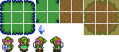
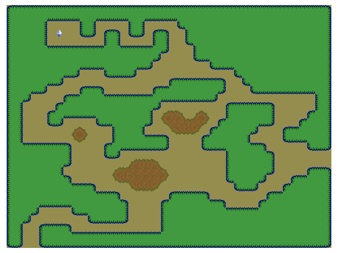

# Challenge facultatif S4-J2
Intitulé : **Zelda : A <Link> to the Past**  
https://github.com/O-clock-Explorer/challenge-s3-j7-zelda-GuillaumeD84

Guillaume DURAND  
Promo : Explorer  
S4-J2 | 24/10/2017

Formateur : Julien  
Type : JavaScript

## Objectif
Générer un terrain, à partir d'un sprite d'image.

### Sprite

### Résultat

